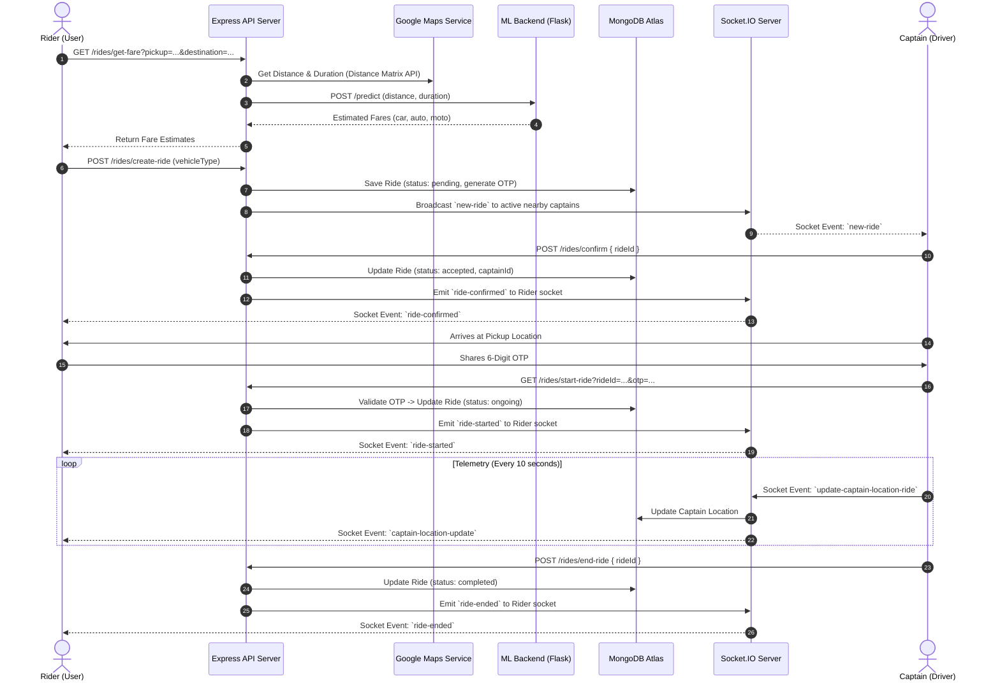
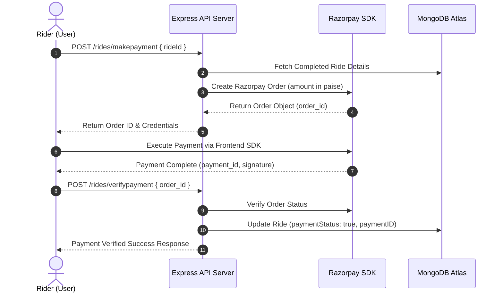

# 🚗 RideNow — Backend Service & API Specification

[](https://nodejs.org/)
[](https://expressjs.com/)
[](https://www.mongodb.com/)
[](https://socket.io/)
[](https://jwt.io/)

The **RideNow Backend** is a production-grade Node.js/Express RESTful API and WebSocket engine powering real-time urban ride matching, dynamic ML-backed pricing, OTP verification, Razorpay payments, and captain telemetry aggregation.

---

## 🏗️ Layered System Architecture

```
┌─────────────────────────────────────────────────────────────────────────┐
│                       Incoming Client Requests                          │
│                (HTTP REST Requests & WebSocket Packets)                 │
└────────────────────────────────────┬────────────────────────────────────┘
                                     │
┌────────────────────────────────────▼────────────────────────────────────┐
│                    Express Routing Layer (app.js)                       │
│    /users        │      /captains       │       /maps      │   /rides   │
└────────────────────────────────────┬────────────────────────────────────┘
                                     │
┌────────────────────────────────────▼────────────────────────────────────┐
│                       Middleware Pipeline Layer                         │
│  - auth.middleware.js (auth, authc, authAny JWT validation)             │
│  - validator.middleware.js (express-validator body/query checkers)      │
│  - multer.middleware.js (Multipart form image uploads to memory)        │
└────────────────────────────────────┬────────────────────────────────────┘
                                     │
┌────────────────────────────────────▼────────────────────────────────────┐
│                           Controller Layer                              │
│  - user.controller.js       - captain.controller.js                      │
│  - ride.controller.js       - map.controller.js                         │
└──────────────────┬──────────────────────────────────┬───────────────────┘
                   │                                  │
┌──────────────────▼─────────────────┐     ┌──────────▼───────────────────┐
│           Service Layer            │     │    Utility & Helper Layer    │
│  - ride.service.js (Fare/Calculations)   │     │  - ApiError.js               │
│  - map.service.js (Google Maps SDK)│     │  - ApiResponse.js            │
│  - email.service.js (SMTP OTP)     │     │  - asyncHandler.js           │
│  - otpStore.js (In-memory verification)  │     │  - cloudinary.js             │
└──────────────────┬─────────────────┘     └──────────────────────────────┘
                   │
┌──────────────────▼──────────────────────────────────────────────────────┐
│                        Data Layer & External Services                   │
│   MongoDB Atlas (User, Captain, Ride, OTP Models) │  Socket.IO Engine   │
│   Flask ML Backend  │  Google Maps APIs  │ Razorpay  │ Nodemailer SMTP │
└─────────────────────────────────────────────────────────────────────────┘
```

---

## ⚡ Sequence Diagrams

### 1. Complete Ride Booking & Real-Time Lifecycle



### 2. Payment & Verification Flow



---

## 🔌 Socket.IO Real-Time Directory

The Socket.IO server runs alongside the Express HTTP server, managing live connections, captain location updates, and trip event dispatches.

### Client $\rightarrow$ Server Events

| Event Name | Payload Structure | Triggering Context | Server Action |
|------------|-------------------|--------------------|---------------|
| `join` | `{ userId: string, userType: "user" \| "captain" }` | Page mount on home / dashboard | Maps socket ID to MongoDB User/Captain document |
| `update-location-captain` | `{ userId: string, location: { ltd: number, lng: number } }` | Captain idle screen (every 10s) | Updates captain status to `active` and saves geolocation |
| `update-captain-location-ride` | `{ userId: string, location: { ltd: number, lng: number }, rideId: string, heading?: number }` | Active trip navigation (every 10s) | Updates captain location & forwards `captain-location-update` to rider |

### Server $\rightarrow$ Client Events

| Event Name | Recipient | Payload | Trigger Context |
|------------|-----------|---------|-----------------|
| `new-ride` | Nearby Captains | `{ _id, user, pickup, destination, fare, distance, duration }` | User creates a new ride |
| `ride-confirmed` | User | `{ _id, status, captain, user }` | Captain accepts ride request |
| `ride-started` | User | `{ _id, status, captain, user }` | Captain verifies OTP & starts trip |
| `ride-ended` | User | `{ _id, status, fare, distance }` | Captain marks trip completed |
| `ride-cancelled` | User | `{ message: "Ride cancelled" }` | Rider or Captain cancels trip |
| `ride-already-confirmed` | Other Captains | `{ rideId }` | Emitted when another captain claims the ride first |
| `captain-location-update` | User | `{ location: { ltd, lng }, heading, rideId }` | Emitted during active trip telemetry |
| `error` | Socket Sender | `{ message: string }` | Emitted when a socket handler encounters an error |

---

## 📋 Data Schemas & Models

### 1. User Model (`model/user.model.js`)

```json
{
  "_id": "64abc1234567890abcdef123",
  "fullname": {
    "firstname": "John",
    "lastname": "Doe"
  },
  "email": "john.doe@example.com",
  "password": "<bcrypt-hashed-string>",
  "mobile": "9876543210",
  "image": "https://res.cloudinary.com/demo/image/upload/v12345678/user.jpg",
  "socketId": "sock_user_9988",
  "refreshtoken": "<JWT-refresh-token>",
  "createdAt": "2026-08-16T10:00:00.000Z",
  "updatedAt": "2026-08-16T10:00:00.000Z"
}
```

| Field | Type | Required | Constraints / Validation |
|-------|------|----------|--------------------------|
| `fullname.firstname` | String | ✅ | Minimum 3 characters |
| `fullname.lastname` | String | ❌ | Minimum 3 characters |
| `email` | String | ✅ | Unique, lowercase, valid email |
| `password` | String | ✅ | Select: false (hidden), bcrypt hashed |
| `mobile` | String | ✅ | Unique, exactly 10 digits |
| `image` | String | ❌ | Default avatar URL |
| `socketId` | String | ❌ | Socket session ID |
| `refreshtoken` | String | ❌ | Refresh JWT string |

### 2. Captain Model (`model/captain.model.js`)

```json
{
  "_id": "64cap9876543210fedcba987",
  "fullname": {
    "firstname": "Raj",
    "lastname": "Kumar"
  },
  "email": "raj.kumar@example.com",
  "password": "<bcrypt-hashed-string>",
  "mobile": "9123456789",
  "status": "active",
  "profilepic": "https://res.cloudinary.com/demo/image/upload/v12345678/captain.jpg",
  "socketId": "sock_cap_1122",
  "vehicle": {
    "color": "Black",
    "plate": "MH12AB1234",
    "capacity": 4,
    "vehicletype": "car"
  },
  "location": {
    "ltd": 18.5204,
    "lng": 73.8567
  },
  "refreshtoken": "<JWT-refresh-token>"
}
```

| Field | Type | Required | Constraints / Validation |
|-------|------|----------|--------------------------|
| `fullname.firstname` | String | ✅ | Minimum 3 characters |
| `fullname.lastname` | String | ✅ | Minimum 3 characters |
| `email` | String | ✅ | Unique, lowercase, valid email |
| `mobile` | String | ✅ | Unique, exactly 10 digits |
| `status` | String | ❌ | Enum: `active`, `inactive`. Default: `inactive` |
| `vehicle.color` | String | ✅ | Minimum 3 characters |
| `vehicle.plate` | String | ✅ | Minimum 3 characters |
| `vehicle.capacity` | Number | ✅ | Minimum 1 |
| `vehicle.vehicletype` | String | ✅ | Enum: `car`, `auto`, `moto` |
| `location.ltd` | Number | ❌ | Latitude coordinate |
| `location.lng` | Number | ❌ | Longitude coordinate |

### 3. Ride Model (`model/ride.model.js`)

```json
{
  "_id": "64ride555444333222111000",
  "user": "64abc1234567890abcdef123",
  "captain": "64cap9876543210fedcba987",
  "pickup": "Shivaji Nagar, Pune, Maharashtra",
  "destination": "Hinjewadi Phase 1, Pune, Maharashtra",
  "fare": 250.00,
  "status": "completed",
  "duration": 1800,
  "distance": 15000,
  "paymentID": "pay_K123456789",
  "orderID": "order_K987654321",
  "signature": "a1b2c3...",
  "paymentStatus": true,
  "rating": 5,
  "isRated": true,
  "rateTime": "2026-08-16T11:00:00.000Z",
  "otp": "482910"
}
```

| Field | Type | Required | Notes |
|-------|------|----------|-------|
| `user` | ObjectId | ✅ | Reference: `User` model |
| `captain` | ObjectId | ❌ | Reference: `Captain` model (populated on confirm) |
| `pickup` | String | ✅ | Pickup address string |
| `destination` | String | ✅ | Destination address string |
| `fare` | Number | ✅ | Trip cost in INR (₹) |
| `status` | String | ❌ | Enum: `pending`, `accepted`, `ongoing`, `completed`, `cancelled`. Default: `pending` |
| `duration` | Number | ❌ | Estimated duration in seconds |
| `distance` | Number | ❌ | Distance in meters |
| `otp` | String | ✅ | Select: false (hidden in default queries) |
| `paymentStatus` | Boolean | ❌ | Default: `false` |
| `rating` | Number | ❌ | Default: `0` |

---

## ⚙️ Environment Variables Reference

Create `.env` inside `Backend/`:

```env
PORT=8000
NODE_ENV=development

# Database
dblink=mongodb+srv://<user>:<password>@cluster.mongodb.net/ridenow

# Authentication Secrets & Expiry
accesstoken=your_jwt_access_token_secret
refreshtoken=your_jwt_refresh_token_secret
accesstime=15m
refreshtime=7d

# Google Maps API Key
GOOGLE_MAPS_API=your_google_maps_api_key

# Razorpay Credentials
RazorPayKey=your_razorpay_key_id
RazorPaySecretKey=your_razorpay_secret_key
Currency=INR

# Nodemailer SMTP Configuration
SMTP_HOST=smtp.gmail.com
SMTP_PORT=587
SMTP_SECURE=false
SMTP_USER=your_email@gmail.com
SMTP_PASS=your_app_password
EMAIL_FROM=noreply@ridenow.com

# Cloudinary Storage
cloud_name=your_cloudinary_cloud_name
api_key=your_cloudinary_api_key
api_secret=your_cloudinary_api_secret

# Service Routing
Model_link=http://localhost:5001
Fontend_URL=http://localhost:5173
```

---

## 🌐 Standard Response Structure

### ✅ Success Envelope (`ApiResponse`)
```json
{
  "statusCode": 200,
  "success": true,
  "message": "Operation completed successfully",
  "data": {}
}
```

### ❌ Error Envelope (`ApiError`)
```json
{
  "statusCode": 400,
  "success": false,
  "message": "Descriptive error message",
  "errors": [],
  "data": null
}
```

---

## 🔐 Verified API Route Specifications

Legend:
- 🔒 **User** = Requires User Access Token (`auth` middleware)
- 🔒 **Captain** = Requires Captain Access Token (`authc` middleware)
- 🔒 **User/Captain** = Accepts either User or Captain Access Token (`authAny` middleware)

---

# 👤 User Endpoints — `/users`

## `POST /users/register`
Register a new User account.

**Request Body (`application/json`)**
```json
{
  "firstname": "John",
  "lastname": "Doe",
  "email": "john@example.com",
  "password": "secretpassword",
  "mobile": "9876543210"
}
```
- `firstname` (string, required, min 3 chars)
- `lastname` (string, optional, min 3 chars)
- `email` (string, required, valid email format)
- `password` (string, required, min 6 chars)
- `mobile` (string, required, exactly 10 digits)

**Response `201 Created`**
```json
{
  "statusCode": 201,
  "success": true,
  "message": "User created successfully",
  "data": {
    "userData": {
      "_id": "64abc123...",
      "fullname": { "firstname": "John", "lastname": "Doe" },
      "email": "john@example.com",
      "mobile": "9876543210"
    },
    "accesstoken": "<jwt_access_token>",
    "refreshtoken": "<jwt_refresh_token>"
  }
}
```

**Errors:**
- `400 Bad Request` — Validation failed / Missing fields
- `409 Conflict` — User with this email already exists
- `500 Internal Server Error` — Registration failed

---

## `POST /users/login`
Authenticate User and receive access/refresh tokens.

**Request Body (`application/json`)**
```json
{
  "email": "john@example.com",
  "password": "secretpassword"
}
```

**Response `200 OK`**
```json
{
  "statusCode": 200,
  "success": true,
  "message": "successfully logged in",
  "data": {
    "user": {
      "_id": "64abc123...",
      "fullname": { "firstname": "John", "lastname": "Doe" },
      "email": "john@example.com",
      "mobile": "9876543210"
    },
    "accesstoken": "<jwt_access_token>",
    "refreshtoken": "<jwt_refresh_token>"
  }
}
```

**Errors:**
- `400 Bad Request` — Missing email or password
- `401 Unauthorized` — Invalid credentials. Please check your password
- `404 Not Found` — User not found

---

## `POST /users/logout` 🔒 User
Log out authenticated user, unsetting socket ID and refresh token.

**Response `200 OK`**
```json
{
  "statusCode": 200,
  "success": true,
  "message": "logged out successfully",
  "data": {}
}
```

---

## `GET /users/profile` 🔒 User
Retrieve authenticated User profile details.

**Response `200 OK`**
```json
{
  "statusCode": 200,
  "success": true,
  "message": "User profile",
  "data": {
    "user": {
      "_id": "64abc123...",
      "fullname": { "firstname": "John", "lastname": "Doe" },
      "email": "john@example.com",
      "mobile": "9876543210",
      "image": "https://cloudinary.com/..."
    }
  }
}
```

---

## `PUT /users/edit-profile` 🔒 User
Update profile details and avatar. Accepts `multipart/form-data`.

**Form Data Fields:**
- `firstname` (string, required)
- `lastname` (string, required)
- `password` (string, optional)
- `image` (file, optional — avatar image)

**Response `200 OK`**
```json
{
  "statusCode": 200,
  "success": true,
  "message": "Profile updated successfully",
  "data": {
    "_id": "64abc123...",
    "fullname": { "firstname": "John", "lastname": "Updated" },
    "email": "john@example.com",
    "image": "https://res.cloudinary.com/..."
  }
}
```

---

## `DELETE /users/delete-user` 🔒 User
Permanently delete user account and clear session cookies.

**Response `200 OK`**
```json
{
  "statusCode": 200,
  "success": true,
  "message": "User deleted successfully",
  "data": null
}
```

---

## `GET /users/ride-history` 🔒 User
Fetch complete ride history for the authenticated user (includes average rating for completed trips).

**Response `200 OK`**
```json
{
  "statusCode": 200,
  "success": true,
  "message": "Ride history retrieved successfully",
  "data": [
    {
      "_id": "64ride123...",
      "pickup": "Shivaji Nagar",
      "destination": "Hinjewadi",
      "fare": 250,
      "status": "completed",
      "captain": { "fullname": { "firstname": "Raj" }, "vehicle": {} },
      "captainAverageRating": { "avgRating": 4.8, "count": 15 },
      "createdAt": "2026-08-16T10:00:00.000Z"
    }
  ]
}
```

---

## `POST /users/Generate-otp`
Send a 6-digit verification code to the target email via SMTP.

**Request Body (`application/json`)**
```json
{
  "email": "john@example.com"
}
```

**Response `200 OK`**
```json
{
  "statusCode": 200,
  "success": true,
  "message": "OTP sent successfully to your email",
  "data": null
}
```

---

## `POST /users/verify-otp`
Verify email OTP.

**Request Body (`application/json`)**
```json
{
  "email": "john@example.com",
  "otp": "123456"
}
```

**Response `200 OK`**
```json
{
  "statusCode": 200,
  "success": true,
  "message": "OTP verified successfully",
  "data": null
}
```

---

## `POST /users/refresh-token`
Request new access token using a valid refresh token.

**Request Body (`application/json`)**
```json
{
  "refreshtoken": "<jwt_refresh_token>"
}
```

**Response `200 OK`**
```json
{
  "statusCode": 200,
  "success": true,
  "message": "access token successful",
  "data": {
    "accesstoken": "<new_jwt_access_token>",
    "refreshtoken": "<new_jwt_refresh_token>"
  }
}
```

---

## `POST /users/captain-rating` 🔒 User
Fetch average rating for a target captain ID.

**Request Body (`application/json`)**
```json
{
  "captainId": "64cap987..."
}
```

**Response `200 OK`**
```json
{
  "statusCode": 200,
  "success": true,
  "message": "Driver rating retrieved successfully",
  "data": {
    "avgRating": 4.8,
    "count": 15
  }
}
```

---

# 🚕 Captain Endpoints — `/captains`

## `POST /captains/register`
Register a new Captain account with vehicle details.

**Request Body (`application/json`)**
```json
{
  "fullname": {
    "firstname": "Raj",
    "lastname": "Kumar"
  },
  "email": "raj@example.com",
  "password": "secretpassword",
  "mobile": "9123456789",
  "vehicle": {
    "color": "Black",
    "plate": "MH12AB1234",
    "capacity": 4,
    "vehicletype": "car"
  }
}
```

**Response `201 Created`**
```json
{
  "statusCode": 201,
  "success": true,
  "message": "captain registered successfully",
  "data": {
    "captain": {
      "_id": "64cap987...",
      "fullname": { "firstname": "Raj", "lastname": "Kumar" },
      "email": "raj@example.com",
      "status": "inactive",
      "vehicle": { "color": "Black", "plate": "MH12AB1234", "capacity": 4, "vehicletype": "car" }
    },
    "accesstoken": "<jwt_access_token>",
    "refreshtoken": "<jwt_refresh_token>"
  }
}
```

---

## `POST /captains/login`
Authenticate Captain credentials.

**Request Body (`application/json`)**
```json
{
  "email": "raj@example.com",
  "password": "secretpassword"
}
```

**Response `200 OK`**
```json
{
  "statusCode": 200,
  "success": true,
  "message": "successfully logged in",
  "data": {
    "captain": {
      "_id": "64cap987...",
      "fullname": { "firstname": "Raj", "lastname": "Kumar" },
      "email": "raj@example.com"
    },
    "accesstoken": "<jwt_access_token>",
    "refreshtoken": "<jwt_refresh_token>"
  }
}
```

---

## `POST /captains/logout` 🔒 Captain
Log out authenticated captain.

**Response `200 OK`**
```json
{
  "statusCode": 200,
  "success": true,
  "message": "logged out successfully",
  "data": {}
}
```

---

## `GET /captains/profile` 🔒 Captain
Fetch authenticated Captain profile.

**Response `200 OK`**
```json
{
  "statusCode": 200,
  "success": true,
  "message": "Captain profile fetched successfully",
  "data": {
    "captainData": {
      "_id": "64cap987...",
      "fullname": { "firstname": "Raj", "lastname": "Kumar" },
      "email": "raj@example.com",
      "vehicle": { "color": "Black", "plate": "MH12AB1234", "capacity": 4, "vehicletype": "car" }
    }
  }
}
```

---

## `GET /captains/history` 🔒 Captain
Get cumulative drive metrics (distance in km, time in hours, earnings in ₹) aggregated from completed rides.

**Response `200 OK`**
```json
{
  "statusCode": 200,
  "success": true,
  "message": "Captain stats fetched successfully",
  "data": {
    "totalDist": 142.5,
    "totalTime": 4.2,
    "totalEarning": 3150.00
  }
}
```

---

## `PUT /captains/edit-profile` 🔒 Captain
Update captain details and vehicle specifications. Accepts `multipart/form-data`.

**Form Data Fields:**
- `firstname` (string, required)
- `lastname` (string, required)
- `password` (string, optional)
- `vehicleColor` (string, optional)
- `vehicleType` (string, optional: `car`, `auto`, `moto`)
- `vehiclePlate` (string, optional)
- `vehicleCapacity` (number, optional)
- `profilepic` (file, optional — avatar image)

**Response `200 OK`**
```json
{
  "statusCode": 200,
  "success": true,
  "message": "Profile updated successfully",
  "data": {}
}
```

---

## `DELETE /captains/delete-captain` 🔒 Captain
Permanently delete captain account.

**Response `200 OK`**
```json
{
  "statusCode": 200,
  "success": true,
  "message": "Captain account deleted successfully",
  "data": null
}
```

---

## `GET /captains/ride-history` 🔒 Captain
Fetch history of trips completed by the authenticated captain.

**Response `200 OK`**
```json
{
  "statusCode": 200,
  "success": true,
  "message": "Ride history found",
  "data": [
    {
      "_id": "64ride123...",
      "pickup": "Shivaji Nagar",
      "destination": "Hinjewadi",
      "fare": 250,
      "status": "completed",
      "user": { "fullname": { "firstname": "John" } }
    }
  ]
}
```

---

## `GET /captains/average-rating` 🔒 Captain
Get average rating score computed across all passenger reviews for this captain.

**Response `200 OK`**
```json
{
  "statusCode": 200,
  "success": true,
  "message": "Average rating calculated successfully",
  "data": {
    "avgRating": 4.8,
    "count": 15
  }
}
```

---

## `POST /captains/Generate-otp`
Send 6-digit OTP to captain email address.

---

## `POST /captains/verify-otp`
Verify captain email OTP.

---

# 🗺️ Map Endpoints — `/maps`

## `GET /maps/get-coordinates` 🔒 User
Geocode an address string into latitude & longitude using Google Maps API.

**Query Parameters:**
- `address` (string, required, min 3 chars) — e.g. `/maps/get-coordinates?address=Shivaji+Nagar`

**Response `200 OK`**
```json
{
  "statusCode": 200,
  "success": true,
  "message": "Coordinates fetched successfully",
  "data": {
    "ltd": 18.5204,
    "lng": 73.8567
  }
}
```

---

## `GET /maps/get-distance-time` 🔒 User
Fetch road distance (meters) and travel duration (seconds) between two addresses using Google Maps Distance Matrix.

**Query Parameters:**
- `origin` (string, required, min 3 chars)
- `destination` (string, required, min 3 chars)

**Response `200 OK`**
```json
{
  "statusCode": 200,
  "success": true,
  "message": "Distance and time fetched successfully",
  "data": {
    "distance": 15000,
    "time": 1800
  }
}
```

---

## `GET /maps/get-suggestions` 🔒 User
Autocomplete address strings using Google Maps Places API.

**Query Parameters:**
- `input` (string, required, min 3 chars) — e.g. `/maps/get-suggestions?input=Koregaon`

**Response `200 OK`**
```json
{
  "statusCode": 200,
  "success": true,
  "message": "Suggestions fetched successfully",
  "data": [
    "Koregaon Park, Pune, Maharashtra, India",
    "Koregaon, Satara, Maharashtra, India"
  ]
}
```

---

# 🛺 Ride Endpoints — `/rides`

## `POST /rides/create-ride` 🔒 User
Create a new ride request and notify nearby active captains via Socket.IO.

**Request Body (`application/json`)**
```json
{
  "pickup": "Shivaji Nagar, Pune",
  "destination": "Hinjewadi Phase 1, Pune",
  "vehicleType": "car"
}
```

**Response `201 Created`**
```json
{
  "statusCode": 201,
  "success": true,
  "message": "Ride created successfully",
  "data": {
    "_id": "64ride123...",
    "user": "64abc123...",
    "pickup": "Shivaji Nagar, Pune",
    "destination": "Hinjewadi Phase 1, Pune",
    "fare": 250.00,
    "status": "pending",
    "duration": 1800,
    "distance": 15000
  }
}
```

---

## `GET /rides/get-fare` 🔒 User
Fetch ML-calculated fare estimates across all vehicle types (`car`, `auto`, `moto`).

**Query Parameters:**
- `pickup` (string, required, min 3 chars)
- `destination` (string, required, min 3 chars)

**Response `200 OK`**
```json
{
  "statusCode": 200,
  "success": true,
  "message": "Fare fetched successfully",
  "data": {
    "auto": 165.00,
    "car": 250.00,
    "moto": 125.00
  }
}
```

---

## `POST /rides/confirm` 🔒 Captain
Captain accepts a pending ride request. Emits `ride-confirmed` to the rider and `ride-already-confirmed` to other captains.

**Request Body (`application/json`)**
```json
{
  "rideId": "64ride123..."
}
```

**Response `200 OK`**
```json
{
  "statusCode": 200,
  "success": true,
  "message": "Ride confirmed successfully",
  "data": {
    "_id": "64ride123...",
    "status": "accepted",
    "captain": { "_id": "64cap987..." },
    "user": { "_id": "64abc123..." }
  }
}
```

---

## `GET /rides/start-ride` 🔒 Captain
Start an accepted ride after verifying rider's 6-digit OTP. Emits `ride-started` to rider.

**Query Parameters:**
- `rideId` (string, required, Mongo ID format)
- `otp` (string, required, exactly 6 digits)

**Response `200 OK`**
```json
{
  "statusCode": 200,
  "success": true,
  "message": "Ride started successfully",
  "data": {
    "_id": "64ride123...",
    "status": "ongoing"
  }
}
```

---

## `POST /rides/end-ride` 🔒 Captain
Mark an ongoing ride as completed. Emits `ride-ended` to rider.

**Request Body (`application/json`)**
```json
{
  "rideId": "64ride123..."
}
```

**Response `200 OK`**
```json
{
  "statusCode": 200,
  "success": true,
  "message": "Ride ended successfully",
  "data": {
    "_id": "64ride123...",
    "status": "completed"
  }
}
```

---

## `POST /rides/cancel-ride` 🔒 User/Captain (`authAny`)
Cancel a pending or accepted ride. Callable by either User or Captain token (`authAny`). Emits `ride-cancelled`.

**Request Body (`application/json`)**
```json
{
  "rideId": "64ride123..."
}
```

**Response `200 OK`**
```json
{
  "statusCode": 200,
  "success": true,
  "message": "Ride cancelled successfully",
  "data": null
}
```

---

## `POST /rides/makepayment` 🔒 User
Generate a Razorpay payment order for a completed ride.

**Request Body (`application/json`)**
```json
{
  "rideId": "64ride123..."
}
```

**Response `200 OK`**
```json
{
  "statusCode": 200,
  "success": true,
  "message": "Payment order created successfully",
  "data": {
    "id": "order_xyz123",
    "amount": 25000,
    "currency": "INR",
    "receipt": "64ride123..."
  }
}
```
*(Note: amount is in paise, e.g. 25000 paise = ₹250.00)*

---

## `POST /rides/verifypayment` 🔒 User
Verify Razorpay payment signature & update ride payment status.

**Request Body (`application/json`)**
```json
{
  "order_id": "order_xyz123"
}
```

**Response `200 OK`**
```json
{
  "statusCode": 200,
  "success": true,
  "message": "Payment verified successfully",
  "data": {}
}
```

---

## `POST /rides/rate` 🔒 User
Submit star rating for a completed ride.

**Request Body (`application/json`)**
```json
{
  "rideId": "64ride123...",
  "rating": 5
}
```

**Response `200 OK`**
```json
{
  "statusCode": 200,
  "success": true,
  "message": "Rating submitted successfully",
  "data": null
}
```

---

## `POST /rides/ride-status` 🔒 User
Query the current status string of a ride.

**Request Body (`application/json`)**
```json
{
  "rideId": "64ride123..."
}
```

**Response `200 OK`**
```json
{
  "statusCode": 200,
  "success": true,
  "message": "Ride status fetched successfully",
  "data": "ongoing"
}
```

---

# ❤️ Healthcheck Endpoint — `/`

## `GET /`
Server readiness and status probe.

**Response `200 OK`**
```json
{
  "statusCode": 200,
  "success": true,
  "message": "Server Running Fine",
  "data": {}
}
```
