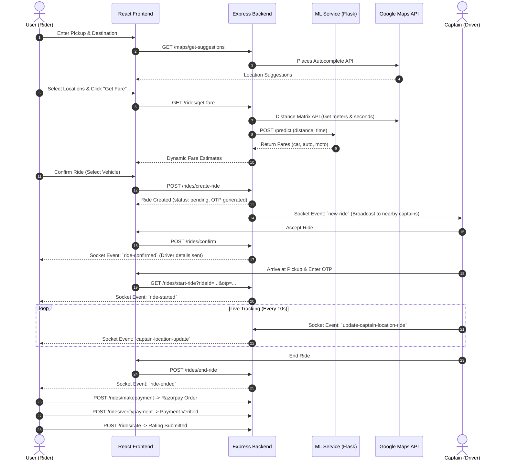

# 🚗 RideNow — Enterprise Full-Stack Ride-Hailing Platform

[](https://nodejs.org/)
[](https://expressjs.com/)
[](https://react.dev/)
[](https://tailwindcss.com/)
[](https://www.python.org/)
[](https://flask.palletsprojects.com/)
[](https://socket.io/)
[](https://www.mongodb.com/cloud/atlas)
[](#-ml-model-performance)

**RideNow** is a production-ready, enterprise-grade full-stack ride-hailing ecosystem inspired by platforms like Uber and Ola. Engineered specifically for high-concurrency urban transit, RideNow features sub-100ms real-time ride matching via Socket.IO, machine-learning-powered dynamic fare prediction (99.92% $R^2$ accuracy), OTP-authenticated passenger pickup verification, integrated Razorpay digital payments, and driver rating aggregation.

---

## 🏗️ System Architecture

### High-Level Micro-Modular Topology

```
                                 ┌───────────────────────────────────────────────┐
                                 │              Client Browsers / Apps           │
                                 │  User Web App   │   Captain Web App           │
                                 └──────┬────────────────────────┬───────────────┘
                                        │                        │
                                 HTTP / REST               WebSocket (Socket.IO)
                                  (Axios)                   (Bidirectional)
                                        │                        │
                                 ┌──────▼────────────────────────▼───────────────┐
                                 │        API Gateway & Core Node.js Server       │
                                 │          (Express.js + Middleware Stack)      │
                                 └──────┬──────────┬──────────┬──────────┬───────┘
                                        │          │          │          │
             ┌──────────────────────────┘          │          │          └──────────────────────────┐
             │ MongoDB Connection                  │ HTTP     │ HTTP                                │ SMTP (Nodemailer)
┌────────────▼──────────────┐             ┌────────▼──┐    ┌──▼─────────┐                    ┌──────▼──────────────┐
│  MongoDB Atlas Database   │             │ ML Backend│    │  Google    │                    │  Email Service      │
│ Users, Captains, Rides,   │             │ (Flask +  │    │  Maps API  │                    │  OTP Delivery       │
│ OTP Tokens                │             │  scikit)  │    └────────────┘                    └─────────────────────┘
└───────────────────────────┘             └─────┬─────┘    (Geocoding, Distance, Places)
                                                │
                                 ┌──────────────▼───────────┐
                                 │   Linear Regression      │
                                 │   Fare Inference Engine  │
                                 └──────────────────────────┘
```

---

## ⚡ Real-Time Data & Event Flow



---

## 📂 Monorepo Structure

```
RideNow/
├── Backend/                   # Node.js, Express, MongoDB, Socket.IO API Server
│   ├── src/
│   │   ├── controller/        # Request handlers (User, Captain, Ride, Map, Health)
│   │   ├── db/                # Mongoose database connection initialization
│   │   ├── middleware/        # Authentication, Multer file upload, Express Validator
│   │   ├── model/             # Mongoose schemas (User, Captain, Ride, OTP)
│   │   ├── route/             # API Router modules (/users, /captains, /maps, /rides)
│   │   ├── service/           # Map services, Ride calculators, OTP store, Nodemailer SMTP
│   │   ├── utils/             # ApiError, ApiResponse, asyncHandler, Cloudinary SDK
│   │   ├── app.js             # Express app setup, CORS, Cookie Parser, Error Middleware
│   │   ├── index.js           # HTTP server startup & Socket.IO initialization
│   │   └── socket.js          # Socket.IO connection handling & real-time events
│   ├── .env                   # Backend environment variables
│   ├── package.json           # Node dependencies
│   └── README.md              # Detailed Backend API Documentation
│
├── frontend/                  # React 19 + Vite Single-Page Application
│   ├── src/
│   │   ├── components/        # UI Panels (VehiclePanel, LocationSearchPanel, Popups)
│   │   ├── context/           # React Context (UserContext, CaptainContext, SocketContext)
│   │   ├── pages/             # App views (Home, Riding, CaptainHome, EditProfile, History)
│   │   ├── App.jsx            # App routes setup & ToastContainer configuration
│   │   └── main.jsx           # Entry point
│   ├── .env                   # Frontend environment variables
│   ├── package.json           # Frontend dependencies
│   ├── vite.config.js         # Vite configuration
│   └── README.md              # Detailed Frontend Documentation
│
└── ml_backend/                # Python Flask Fare Prediction Service
    ├── app.py                 # Flask REST server (/predict, /original, /)
    ├── train_linear_model.py  # Model training & K-Fold cross validation pipeline
    ├── generate_indian_data.py# 50,000 synthetic ride dataset generator
    ├── car_rides_data.csv     # Training dataset
    ├── linear_car_model.pkl   # Serialized Linear Regression model
    ├── requirements.txt       # Python dependencies
    ├── Model_Accuracy.md      # Full model validation report
    └── README.md              # Detailed ML Service Documentation
```

---

## ✨ Feature & Security Matrix

### 👤 Rider Features
- **OTP Email Verification:** Nodemailer SMTP integration for 6-digit email authentication.
- **Location Autocomplete:** Real-time Google Places API address suggestions.
- **Dynamic Fare Estimates:** Instant price comparison across Car, Auto, and Moto powered by ML.
- **Live Ride Map:** Real-time captain location tracking rendered via Google Maps JavaScript SDK.
- **Secure OTP Ride Start:** 6-digit start code verification to prevent unauthorized ride commencement.
- **Razorpay Payments:** Native checkout integration with server-side HMAC SHA256 signature verification.
- **Captain Rating:** Post-ride 5-star rating system linked to driver aggregates.
- **Profile & History:** Multipart profile image upload via Cloudinary & detailed trip history.

### 🚕 Captain Features
- **Vehicle Onboarding:** Vehicle plate, color, capacity, and vehicle type registration (`car`, `auto`, `moto`).
- **Live Dispatch Alert:** Sub-100ms incoming ride popups with pickup/destination distances.
- **Atomic Ride Acceptance:** Race-condition-free socket confirmation preventing multi-captain claims.
- **Driver Dashboard Aggregates:** Real-time earnings summary, total distance (km), and total hours driven computed via MongoDB aggregations.
- **Navigation & Tracking:** Active trip turn-by-turn map updates emitted directly to user socket sessions.

### 🛡️ System Security & Resilience
- **Token Rotation:** Dual-token architecture (Access Token: 15m lifespan; Refresh Token: 7d lifespan).
- **Credentials Protection:** Password hashing using `bcrypt` (10 salt rounds).
- **Cookie Security:** Auth tokens set in HTTP-Only, SameSite cookies with fallback Bearer header authentication.
- **ML Fallback Engine:** Automatic fallback to hardcoded mathematical fare formulas if the Flask ML API is unavailable.
- **Global Error Handling:** Standardized JSON error response envelope (`ApiError`, `ApiResponse`).

---

## 🛠️ Tech Stack Master Reference

| Layer | Technology | Purpose |
|-------|-----------|---------|
| **Frontend Framework** | React 19.1.0, Vite 6.3.5 | Single Page Application UI Engine |
| **Styling & Animation**| Tailwind CSS 4.1, GSAP 3.13 | Utility-first layout & smooth sliding panels |
| **Map SDKs** | `@react-google-maps/api` | Live map rendering, markers, and polyline directions |
| **Payment Gateway** | Razorpay Node & JS SDK | Integrated payments & verification |
| **Real-time Engine** | Socket.IO 4.8.1 (Client & Server) | WebSocket event broadcasting |
| **Backend API Server**| Node.js v20+, Express.js 4.21 | RESTful API gateway |
| **Database** | MongoDB Atlas, Mongoose 8.12 | NoSQL document storage & schema validation |
| **Authentication** | JSON Web Tokens (`jsonwebtoken`), `bcrypt` | Stateless access/refresh token security |
| **Media Storage** | Cloudinary SDK, Multer | Cloud image storage for user/captain avatars |
| **Email Gateway** | Nodemailer | SMTP transactional OTP delivery |
| **ML Runtime** | Python 3.13, Flask 3.0.3, Gunicorn | Microservice container for machine learning |
| **ML Toolkit** | `scikit-learn` 1.5.2, `pandas`, `numpy` | Linear Regression model & data processing |

---

## 🌐 Production Deployment Topology

| Service | Host Platform | Production URL | Description |
|---------|---------------|----------------|-------------|
| **Frontend** | Netlify | `https://ridenoww.netlify.app/` | Production React SPA build |
| **Backend API** | Render | `https://ridenowb.onrender.com` | Express API + Socket.IO server |
| **ML Backend** | Render | `https://ridenow-ml.onrender.com` | Python Flask Machine Learning Service |

---

## ⚙️ Environment Variables Master Directory

### Backend (`Backend/.env`)
```env
PORT=8000
NODE_ENV=development

# Database
dblink=mongodb+srv://<username>:<password>@cluster.mongodb.net/ridenow

# Security / Auth
accesstoken=your_jwt_access_token_secret_key
refreshtoken=your_jwt_refresh_token_secret_key
accesstime=15m
refreshtime=7d

# Google Maps API
GOOGLE_MAPS_API=your_google_maps_api_key

# Payment Gateway
RazorPayKey=your_razorpay_key_id
RazorPaySecretKey=your_razorpay_secret_key
Currency=INR

# SMTP Email (OTP Service)
SMTP_HOST=smtp.gmail.com
SMTP_PORT=587
SMTP_SECURE=false
SMTP_USER=your_email@gmail.com
SMTP_PASS=your_app_password
EMAIL_FROM=noreply@ridenow.com

# Media Storage
cloud_name=your_cloudinary_cloud_name
api_key=your_cloudinary_api_key
api_secret=your_cloudinary_api_secret

# Internal Microservice Links
Model_link=http://localhost:5001
Fontend_URL=http://localhost:5173
```

### Frontend (`frontend/.env`)
```env
VITE_BASE_URL=http://localhost:8000
VITE_GOOGLE_MAPS_API_KEY=your_google_maps_api_key
VITE_RazorPayKey=your_razorpay_key_id
```

---

## 🏃 Local Development Setup

### 1. Repository Setup
```bash
git clone https://github.com/adityapansare99/RideNow.git
cd RideNow
```

### 2. Boot Machine Learning Microservice
```bash
cd ml_backend
python -m venv venv
# On Windows:
.\venv\Scripts\activate
# On Linux/macOS:
source venv/bin/activate

pip install -r requirements.txt
python app.py
# ML Service active at http://localhost:5001
```

### 3. Boot Core Express Backend
```bash
# In a new terminal tab:
cd Backend
npm install
npm run dev
# Express API active at http://localhost:8000
```

### 4. Boot React Frontend App
```bash
# In a third terminal tab:
cd frontend
npm install
npm run dev
# Frontend application active at http://localhost:5173
```

> ⚠️ **Boot Sequence Rule:** Always start `ml_backend` first, followed by `Backend`, and finally `frontend` to guarantee all API dependencies resolve cleanly.

---

## 📊 ML Model Performance Summary

| Evaluation Metric | Score / Benchmark | Status |
|-------------------|-------------------|--------|
| **Algorithm** | Linear Regression | Verified |
| **Coefficient of Determination ($R^2$)** | **0.9992 (99.92%)** | Exceptional |
| **Mean Absolute Error (MAE)** | **₹4.94** | $<1\%$ Avg Fare Error |
| **Root Mean Squared Error (RMSE)** | **₹6.63** | High Consistency |
| **Cross Validation Strategy** | 5-Fold Cross Validation | Zero Overfitting |
| **Dataset Size** | 50,000 Synthetic Indian Urban Rides | Standardized |

> For complete mathematical derivation and training validation scripts, consult [ml_backend/Model_Accuracy.md](./ml_backend/Model_Accuracy.md).

---

## 📚 Module README Index

| Folder | Module Documentation | Key Topics Covered |
|--------|----------------------|-------------------|
| `Backend/` | [Backend README](./Backend/README.md) | Verified API Routes, Controller Logic, Socket Events, Mongoose Schemas |
| `frontend/` | [Frontend README](./frontend/README.md) | Component Hierarchy, Context API, GSAP Panels, Google Maps Hooks |
| `ml_backend/` | [ML Backend README](./ml_backend/README.md) | Flask Inference API, Multiplier Equations, K-Fold Validation Scripts |